# Exercise 1 & 2 Documentation
## Exercise 1
### Part 1
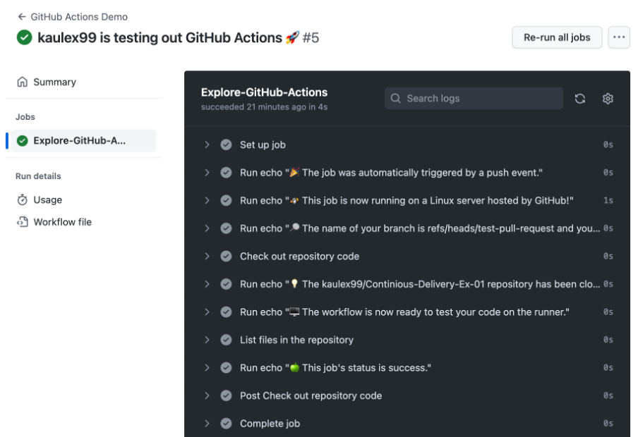

```yml
name: Java CI 01 for compile sources
run-name: ${{ github.actor }} runs compile sources 🚀
on: [push]
jobs:
 build:
  runs-on: ubuntu-latest
  steps:
    - uses: actions/checkout@v3
    - name: Set up JDK 19
      uses: actions/setup-java@v3
      with:
        java-version: '19'
        distribution: 'adopt'
        cache: maven
    - name: Build with Maven
      run: mvn --batch-mode --update-snapshots package
```

#### Without cache
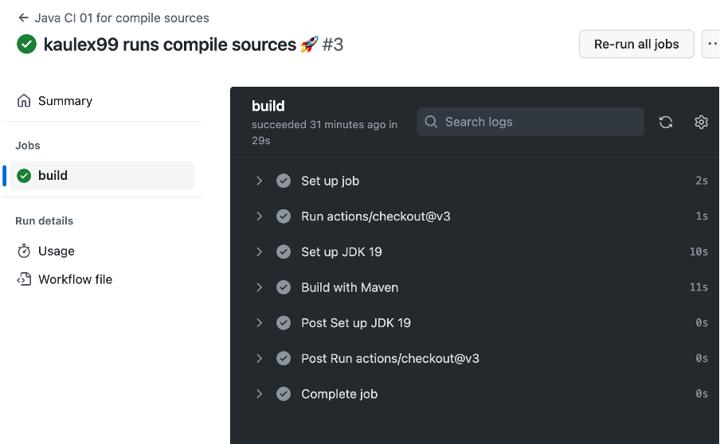

#### With cache
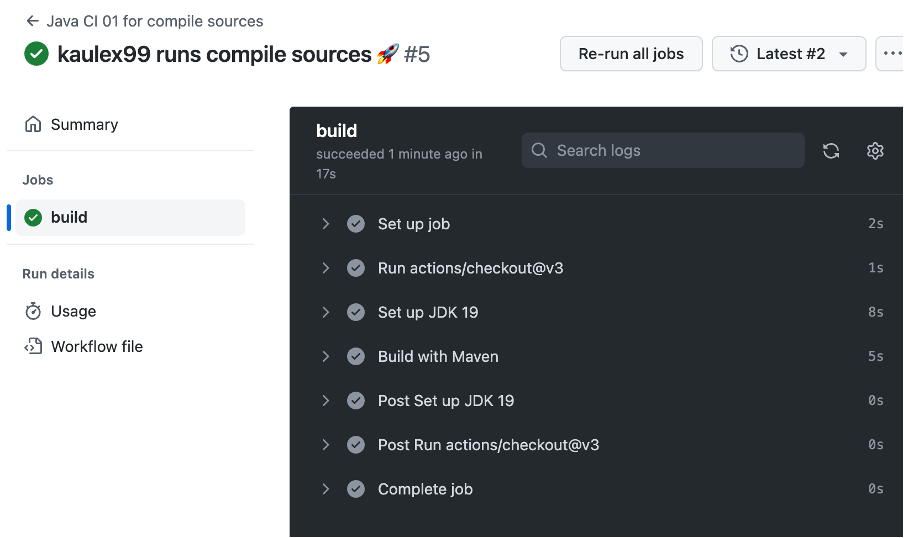
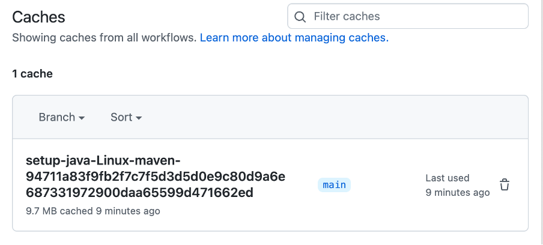

### Part 2
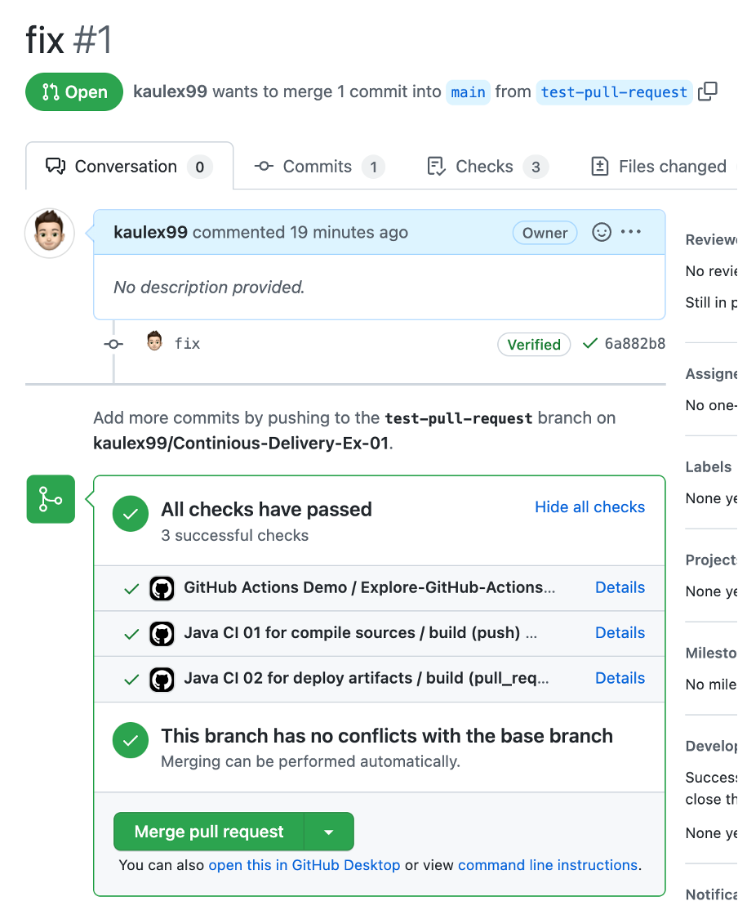
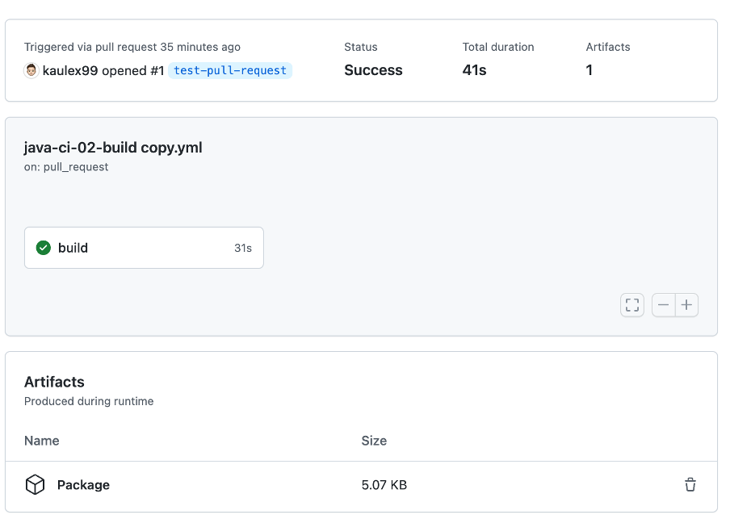

#### Java styling
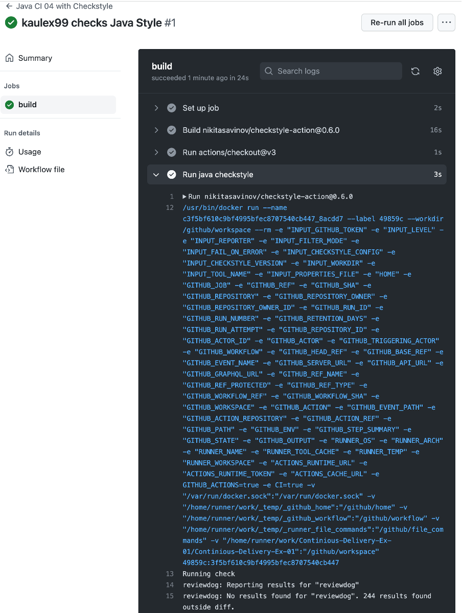
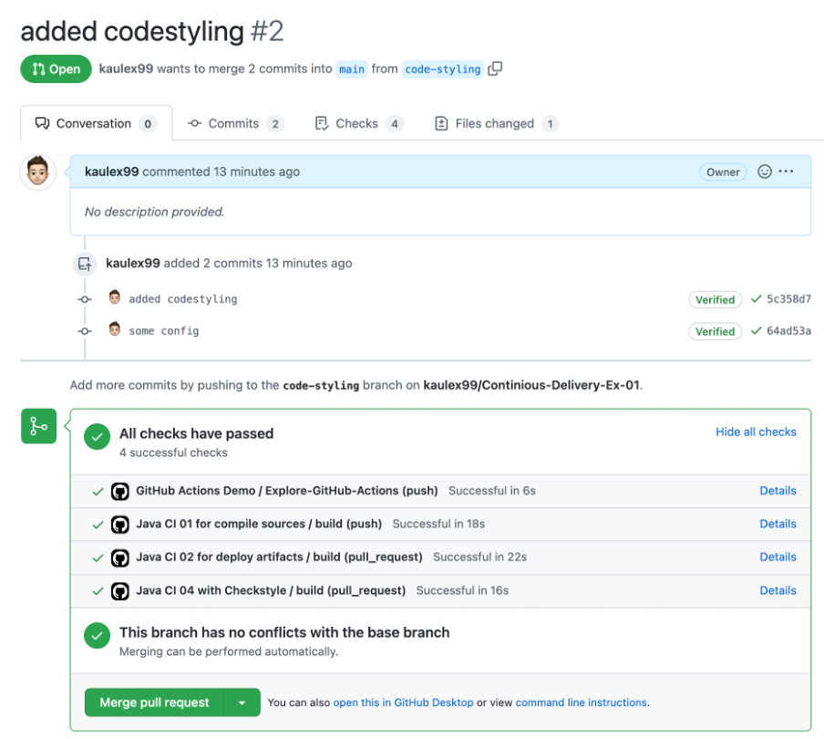
```yml
name: Java CI 04 with Checkstyle
run-name: ${{ github.actor }} checks Java Style
on: [pull_request]
jobs:
 build:
  runs-on: ubuntu-latest
  steps:
    - uses: actions/checkout@v3
    - name: Run java checkstyle
      uses: nikitasavinov/checkstyle-action@0.6.0
      with:
        github_token: ${{ secrets.GITHUB_TOKEN }}
        reporter: 'github-check'
        tool_name: 'testtool'
        level: 'error'
        fail_on_error: true
```

### Part 3 / Techdemo
**There are different types of Static Application Security Testing (SAST).** 
- Scanning the dependencies list for libraries with known vulnerabilities
- Analysing the code searching for common patterns (similar as anti-virus scanner do) or exposed secrets
- Analysis of whole Docker Containers and the software contained in it

Snyk is a tool to do SAST. It analyzes the dependencies vulnerabilities.

#### Workflow setup
This could also be executed on a scheduled basis. In this example it is only triggered manually. The tokens/secrets need to be setup because an account for Snyk is needed.

See [repository](https://github.com/DatepollSystems/water-level-monitor-backend)

```yml
name: SAST using Snyk

on: [ workflow_dispatch ]

jobs:
  security:
    runs-on: ubuntu-latest
    steps:
      - name: Checkout
        uses: actions/checkout@v3
      - name: Run Snyk to check for vulnerabilities
        uses: snyk/actions/gradle-jdk17@master
        continue-on-error: true # To make sure that SARIF upload gets called
        with:
          args: --all-sub-projects
        env:
          SNYK_TOKEN: ${{ secrets.SNYK_TOKEN }}
      - name: Upload Scan result to GitHub Code Scanning
        uses: github/codeql-action/upload-sarif@v2
        with:
          sarif_file: snyk.sarif
```

#### Result of action
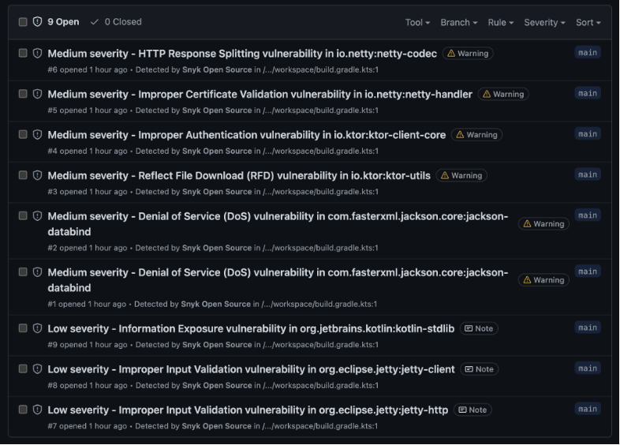
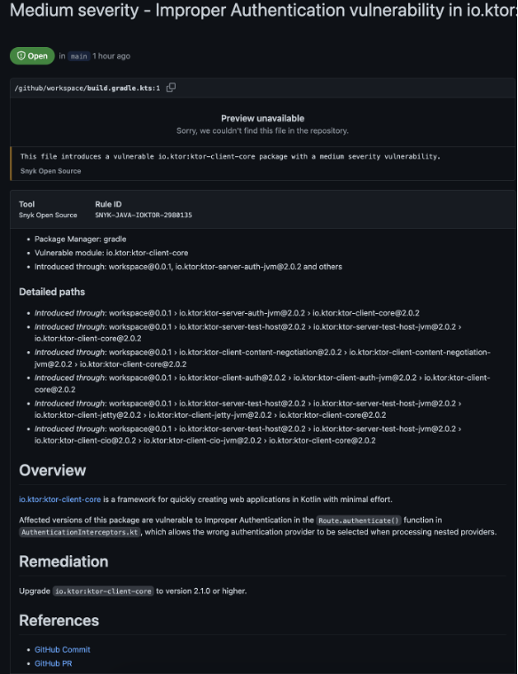

### Questions
**Wann können Workflows ausgelöst werden?**

Unterschiedliche git Ereignisse wie z.B. Push, Merge, Pull requests, tags sowie scheduled als auch manuell können einen Workflow auslösen

**Wann macht es in einem Projekt Sinn einen Workflow auszulösen?**

Es kommt drauf an. Releases machen keinen Sinn nach jedem push sondern sollten eher nur bei tags ausgeführt werden.
Es macht aber durchaus Sinn nach jedem push alle tests laufen zu lassen.

**Welche Schritte sind für Ihr Projekt automatisierbar?**
Fast alle außer der Java styling Schritt, da ich Kotlin verwende :-).

**Wie sind Workflows grundlegend aufgebaut?**

- name
- on
- jobs
  - steps

**Wozu dienen unterschiedliche Runner (Betriebssysteme) in GitHub Actions?**

Da man z.B. iOS nicht auf einem nicht macOS Gerät builden kann, braucht man auch hier einen entsprechenden runner.

**Wie können auch unterschiedliche Versionen, zB Java mittels Workflows automatisiert getestet werden? (Stichwort: Matrix Strategy)**

Es gibt ein strategy Keyword für den Job welches man hierfür verwenden kann um auf unterschiedliche Versionen zu testen.
```yml
strategy: 
    matrix:
        os: [ ubuntu-latest, macos-latest ] 
        java_version: [ 11, 17, 19 ]
```


## Exercise 2
### Part 1
Installation already done.

### Part 2
```bash
docker pull nginx
docker run -it --rm -d -p 8080:80 --name web nginx
```
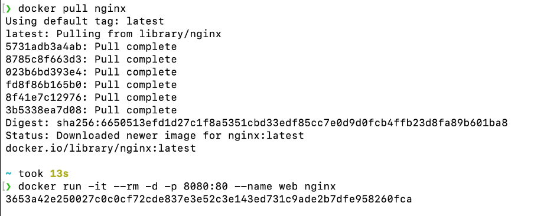

### Part 3
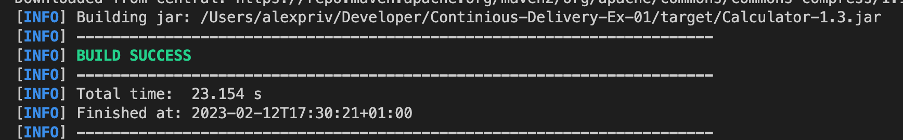
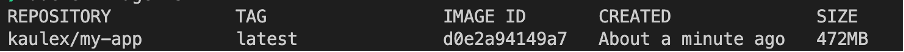
```bash
java -jar Calculator-1.3.jar add 1 4
```
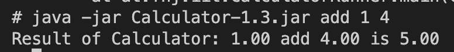

### Part 4
<!-- 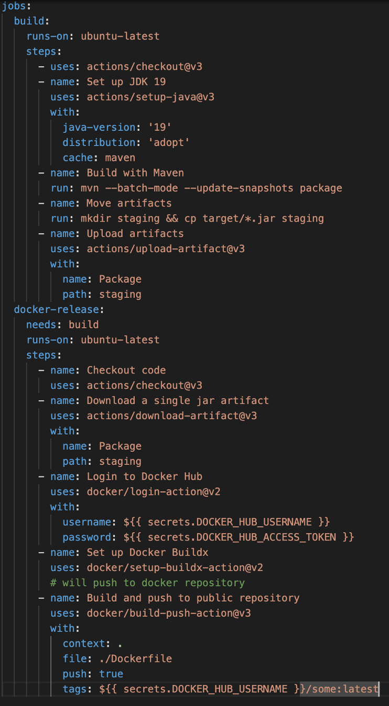 -->
```yml
name: Java CI 02 for deploy artifacts
run-name: ${{ github.actor }} will deploy artifacts 🚀
on: [pull_request]
jobs:
  build:
    runs-on: ubuntu-latest
    steps:
      - uses: actions/checkout@v3
      - name: Set up JDK 19
        uses: actions/setup-java@v3
        with:
          java-version: '19'
          distribution: 'adopt'
          cache: maven
      - name: Build with Maven
        run: mvn --batch-mode --update-snapshots package
      - name: Move artifacts
        run: mkdir staging && cp target/*.jar staging
      - name: Upload artifacts
        uses: actions/upload-artifact@v3
        with:
          name: Package
          path: staging
  docker-release:
    needs: build
    runs-on: ubuntu-latest
    steps:
      - name: Checkout code
        uses: actions/checkout@v3
      - name: Download a single jar artifact
        uses: actions/download-artifact@v3
        with:
          name: Package
          path: staging
      - name: Login to Docker Hub
        uses: docker/login-action@v2
        with:
          username: ${{ secrets.DOCKER_HUB_USERNAME }}
          password: ${{ secrets.DOCKER_HUB_ACCESS_TOKEN }}
      - name: Set up Docker Buildx
        uses: docker/setup-buildx-action@v2
        # will push to docker repository
      - name: Build and push to public repository
        uses: docker/build-push-action@v3
        with:
          context: .
          file: ./Dockerfile
          push: true
          tags: ${{ secrets.DOCKER_HUB_USERNAME }}/some:latest
```

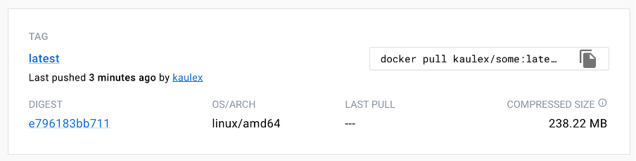
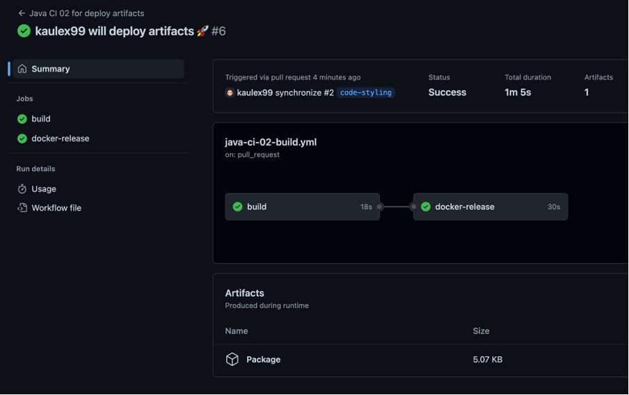

